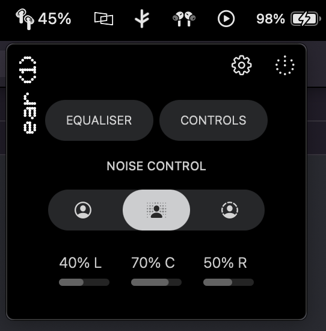
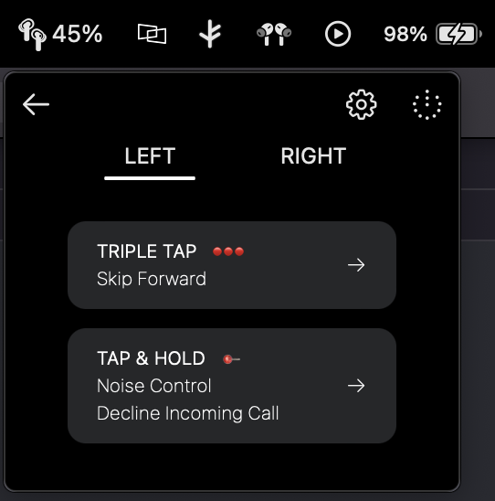
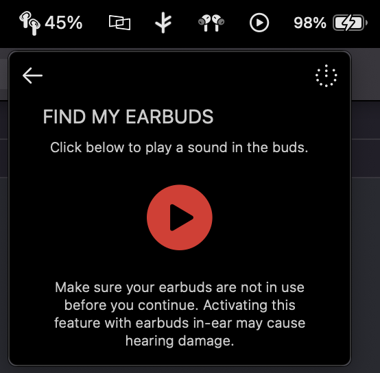

# Nothing X MacOS [Unofficial]

This is a companion app for Nothing Ear (1) for MacOS. The Nothing X iOS App inspired it.

> Note: This currently does not work as is, but the UI is complete. There is a significant hurdle with MacOS where I need help to read data using the BT connection. I can write to it. That is how I can make the buds ring using the UI. But cannot read any data from that connection. I am open-sourcing this so that the community can take it up. Feel free to contact me to understand the details of the project.
> I have also made a simple version of this for anyone to test it [rfcomm-macos-swift](https://github.com/arunavo4/rfcomm-macos-swift)

## UI Screenshots

<table>
  <tr>
  <td></td>
    <td></td>
  </tr>
  <tr>
    <td></td>
    <td></td>
  </tr>
</table>

## LICENSE
