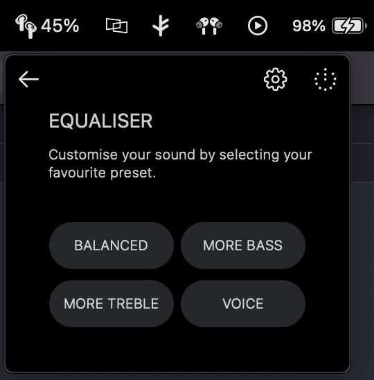

# Nothing X MacOS [Unofficial]

This is a companion app for Nothing Ear (1) for MacOS. The Nothing X iOS App inspired it.

> Note: This currently does not work as is, but the UI is complete. There is a significant hurdle with MacOS where I need help to read data using the BT connection. I can write to it. That is how I can make the buds ring using the UI. But cannot read any data from that connection. I am open-sourcing this so that the community can take it up. Feel free to contact me to understand the details of the project.
> I have also made a simple version of this for anyone to test it [rfcomm-macos-swift](https://github.com/arunavo4/rfcomm-macos-swift)

## UI Screenshots

<table>
  <tr>
  <td></td>
    <td></td>
  </tr>
  <tr>
    <td></td>
    <td></td>
  </tr>
</table>

## LEGAL

The program and its corresponding code are distributed under the provisions of the GNU General Public License v3.0. (LICENSE)

Any entities, including Nothing Technology Limited and its associated organizations, are legally licensed to use this application for all intents and purposes, encompassing commercial usage, devoid of any obligation to remunerate the software creator. Abidance by the GNU General Public License v3.0 is not mandated for Nothing Technology.

This application has been crafted by Arunavo, and does not possess any association with, sponsorship from, or endorsement by Nothing Technology. The application's creator, Arunavo, bears no liability for the correctness or comprehensiveness of the materials and content delivered via this application. The elements incorporated within this application, such as text, graphics, logos, imagery, and audio-visual resources, are the exclusive property of Nothing Technology Limited, located at 80 Cheapside, London EC2V 6EE, and are safeguarded by copyright, trademark, and other intellectual property legislations. The use of these resources is prohibited without the explicit written consent of Nothing Technology. All rights pertaining to these resources are retained by Nothing Technology.
